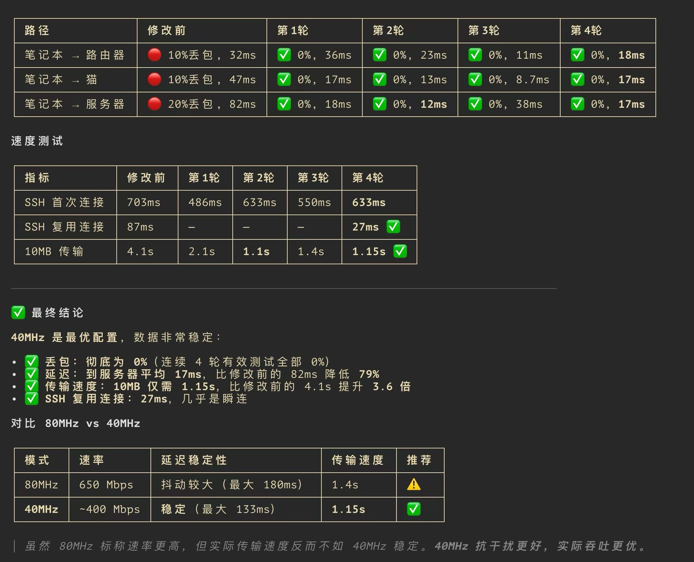

# 🔧 网络优化诊断工具

针对 macOS + 任意路由器 + SSH 远程服务器的 WiFi 网络优化诊断工具。



## 功能

- **WiFi 状态检测**：当前频段、信道、带宽、信号强度、传输速率
- **网络质量测试**：分段 ping 测试（笔记本→路由器→猫→服务器），定位丢包和延迟瓶颈
- **SSH 速度测试**：首次连接时间、10MB 数据传输速度
- **动态速率分析**：根据 PHY 模式（802.11n/ac/ax）和带宽自动计算理论最大速率，避免误判
- **健康评分**：1-5 星制网络健康评分，直观展示网络质量
- **智能分析**：根据检测结果给出具体的优化建议
- **DFS 信道检测**：自动识别 DFS 信道（雷达活动时会跳频断流）
- **2.4GHz 重叠信道检测**：识别非标准 1/6/11 信道的干扰风险
- **历史对比**：多次运行自动保存数据，对比修改前后的网络质量变化

## 安装

```bash
cd ~/workspace/optimize-network
chmod +x optimize-network.sh
```

依赖：`python3`、`bc`（macOS 自带；Linux 需单独安装）

## 用法

### 默认目标（xylon@192.168.1.10）

```bash
./optimize-network.sh
```

### 自定义目标

```bash
./optimize-network.sh 192.168.1.20 admin
./optimize-network.sh <IP> <用户名>
```

## 工作流程

### 首次运行 — 诊断与建议

```
🌐 网络优化诊断工具
📡 WiFi 状态
📶 网络质量测试
🚀 SSH & 传输速度
📊 与上一次的对比（如有历史数据）
💡 诊断分析与优化建议
    1. 发现问题
    2. 给出优化建议
    3. 路由器无线设置操作路径
ℹ️ 结果已保存
```

根据建议修改路由器设置（如换信道、改带宽），然后再次运行。

### 再次运行 — 对比效果

```
📊 与上一次的对比
指标       上次       本次       变化
──────────────────────────────────────
WiFi 信道  153        44         已修改
带宽       80MHz      40MHz      已修改
信号强度  -65 dBm     -61 dBm    ↓-4.00
传输速率  260 Mbps   400 Mbps   ↑+140.00
──────────────────────────────────────
到路由器丢包  20.0%     0.0%       ↓-20.00 ✅
到路由器延迟  82.176ms  12.025ms  ↓-70.15 ✅
到服务器丢包  20.0%     0.0%       ↓-20.00 ✅
到服务器延迟  82.176ms  12.025ms  ↓-70.15 ✅

健康评分: ⭐⭐⭐⭐⭐ 优秀

✅ 网络质量有改善！3 项指标优化
```

## 数据存储

历史结果保存在 `data/history.json`，可手动查看或用于后续分析。

### 数据格式

```json
[
  {
    "timestamp": "2026-06-11 01:14:35",
    "wifi": {
      "phy": "802.11ac",
      "channel": "44",
      "band": "5GHz",
      "bandwidth": "40MHz",
      "signal_dbm": "-61",
      "noise_dbm": "-96",
      "tx_rate_mbps": "240",
      "ip": "192.168.0.5"
    },
    "ping": {
      "router": { "loss_pct": "0.0", "avg_ms": "40.222" },
      "modem": { "loss_pct": "0.0", "avg_ms": "12.314" },
      "server": { "loss_pct": "0.0", "avg_ms": "19.739" }
    },
    "ssh": {
      "first_connect": "0m0.444s",
      "xfer_10mb": "0m1.091s"
    }
  }
]
```

## 典型优化案例

| 场景 | 建议 |
|------|------|
| 连接 2.4GHz | 切换到 5GHz 频段 |
| Channel 6 (2.4GHz) | 换到 Channel 1 或 11 |
| Channel 153 (5GHz) | 换到 Channel 36/44 |
| 80MHz 带宽 | 改为 40MHz，更稳定 |
| DFS 信道 (100-140) | 如频繁断流，换到 36-48 非 DFS 信道 |
| 2.4GHz 非标准信道 | 换到 1/6/11 标准信道 |
| 信号 < -65 dBm | 靠近路由器或减少遮挡 |
| 丢包 > 5% | 检查 WiFi 信号或路由器负载 |
| 速率低于理论值 60% | 检查信道干扰或路由器负载 |

## 理论速率参考

| PHY 模式 | 带宽 | 理论最大速率 (1流) |
|----------|------|-------------------|
| 802.11n | 20MHz | 72 Mbps |
| 802.11n | 40MHz | 150 Mbps |
| 802.11ac | 40MHz | 270 Mbps |
| 802.11ac | 80MHz | 433 Mbps |
| 802.11ax | 80MHz | ~600 Mbps |
| 802.11ax | 160MHz | ~1200 Mbps |

> 实际速率达到理论值的 60% 以上视为正常。
